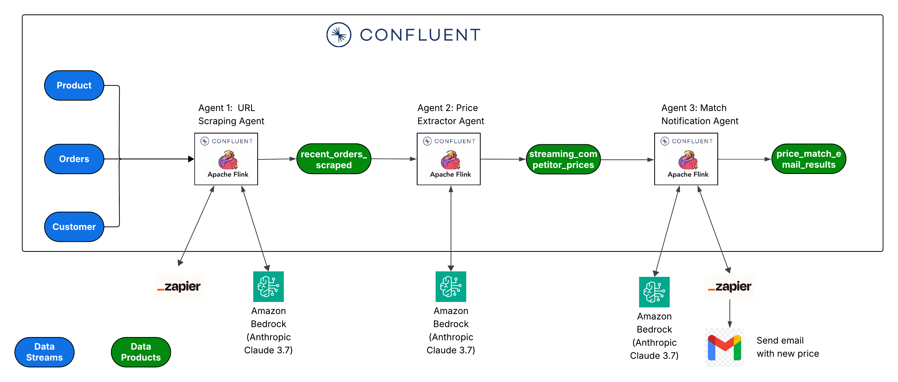
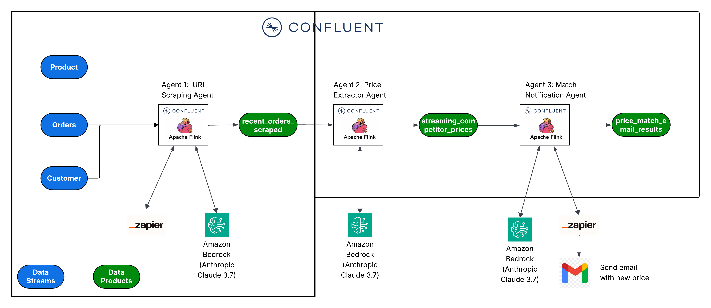
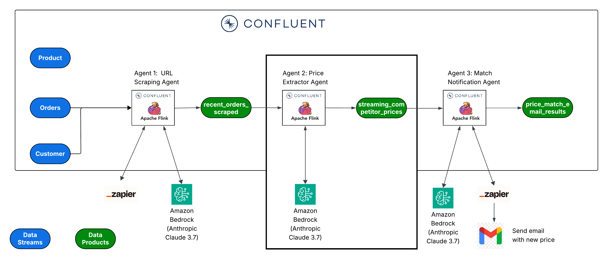
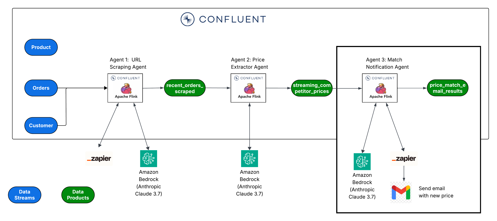

## Lab 1: Price Matching Using Tool Calling 

In this lab, we'll use Confluent Cloud's Apache Flink tool calling feature to look up products in real-time orders. The LLM, through tool calling, uses a Zapier MCP server to retrieve competitor prices, and if a competitor offers a better price, the agent automatically applies a price match.



### Connecting to Flink

Confluent Cloud Flink Compute Pool is a managed environment that provides the resources needed to run Apache Flink jobs directly within Confluent Cloud. It eliminates the need for self-managed Flink clusters by offering a scalable, serverless compute layer for stream processing and real-time analytics on data in Confluent topics.

In [Flink UI](https://confluent.cloud/go/flink), choose the Environment. 

You will see a compute pool created for you. Click on **Open SQL Workspace**


### Agent 1: URL Scraping Agent

First, we need to enrich incoming Orders with product names, then search for and scrape these products from competitors’ websites. We’ll achieve this using Flink’s Tool Calling feature, which will enable Flink to invoke the Zapier MCP server we previously created.



In the Flink workspace, register the model and bind the tool to it in the Confluent catalog:

> **Note:**  
> If you changed the `prefix`, retrieve the updated query from `mcp_commands.txt` in the Terraform directory.  
> The example below uses Amazon Bedrock.

```sql
  CREATE MODEL `zapier_mcp_model`
  INPUT (prompt STRING)
  OUTPUT (response STRING)
  WITH (
    'provider' = 'bedrock',
    'task' = 'text_generation',
    'bedrock.connection' = 'streaming-agents-bedrock-connection',
    'bedrock.params.max_tokens' = '20000',
    'mcp.connection' = 'zapier-mcp-connection'
  );
```

Run this in Flink Workspace UI to start the first agent:

```sql
-- Get recent orders, scrape competitor website for same product
SET 'sql.state-ttl' = '1 HOURS';
CREATE TABLE recent_orders_scraped AS
SELECT
    o.order_id,
    p.product_name,
    c.customer_email,
    o.price as order_price,
    (AI_TOOL_INVOKE(
        'zapier_mcp_model', 
        CONCAT('Use the webhooks_by_zapier_get tool to extract page contents. ',
               'Instructions: Extract the page contents from the following URL: ',
               'https://www.walmart.com/search?q="', 
               p.product_name, '"'),
        MAP[],
        MAP['webhooks_by_zapier_get', 'Fire off a single GET request with optional querystrings.'],
        MAP['debug', 'true', 'on_error', 'continue']
    ))['webhooks_by_zapier_get']['response'] as page_content
FROM orders o
JOIN customers c ON o.customer_id = c.customer_id  
JOIN products p ON o.product_id = p.product_id;
```

This agent uses the `product_name` as an input to URL scraping tool. The output is the `page_content` of the same product on the competitor website.

### Agent 2: Price Extractor Agent

Agent 2 will take `recent_orders_scraped` topic as an input and extract the competitor price from the `page_content` field.



In Flink workspace, register the model for Agent 2 in Confluent catalog:

> **Note:**  
> If you changed the `prefix`, retrieve the updated query from `mcp_commands.txt` in the Terraform directory.  
> The example below uses Amazon Bedrock.

```sql
  CREATE MODEL `llm_textgen_model`
  INPUT (prompt STRING)
  OUTPUT (response STRING)
  WITH(
    'provider' = 'bedrock',
    'task' = 'text_generation',
    'bedrock.connection' = 'jhines-streaming-agents-bedrock-connection',
    'bedrock.params.max_tokens' = '20000'
  );
```

Start **Agent 2** to extract the competitor’s price from `page_content` and output it as a new field: `extracted_price`.

```sql
-- Extract prices from scraped webpages using AI_COMPLETE
CREATE TABLE streaming_competitor_prices AS
SELECT
    ros.order_id,
    ros.product_name,
    ros.customer_email,
    ros.order_price,
    llm.response as extracted_price
FROM recent_orders_scraped ros
CROSS JOIN LATERAL TABLE(
    AI_COMPLETE('llm_textgen_model', 
        CONCAT('Analyze this search results page for the following product name: "', ros.product_name, 
               '", and extract the price of the product that most closely matches the product name. ',
               'Return only the price in format: XX.XX. For example, return only: 29.95. ',
               'Page content: ', ros.page_content)
    )
) AS llm
WHERE ros.page_content IS NOT NULL 
  AND ros.page_content NOT LIKE 'MCP error%'
  AND ros.page_content <> '';
```


In a new cell, check the output of `streaming_competitor_prices`

```sql
SELECT * FROM streaming_competitor_prices;
```


Notice the new field `extracted_price`. This will be used by the next Agent.


### Agent 3: Price Match Notification Agent

In this step, we’ll notify the customer when a price match has been applied.  
We’ll again use Confluent Cloud’s tool-calling feature — this time connecting to the Zapier MCP server to trigger an email or message to the customer.



We don’t need to register a new model here. Instead, we’ll reuse the one from Agent 1, since both agents use the same Zapier MCP server and share the same tools.  For this agent, the tool is `gmail_send_email`.

Start Agent 3 by running:

```sql
-- Create and send professional email notifications for price matches
CREATE TABLE price_match_email_results AS
SELECT
    scp.order_id,
    scp.customer_email,
    scp.product_name,
    CAST(CAST(scp.order_price AS DECIMAL(10, 2)) AS STRING) as order_price,
    CAST(CAST(scp.competitor_price AS DECIMAL(10, 2)) AS STRING) as competitor_price,
    CAST(CAST((scp.order_price - scp.competitor_price) AS DECIMAL(10, 2)) AS STRING) as savings,
    AI_TOOL_INVOKE('zapier_mcp_model', 
                   CONCAT('Use the gmail_send_email tool to send an email. ',
                          'Instructions: send yourself an email to your own email address, ',
                          'subject "✅ Great News! Price Match Applied - Order #', scp.order_id, '", ',
                          'body "Subject: Your Price Match Has Been Applied - Order #', scp.order_id, '

Dear Valued Customer,

We have great news! We found a better price for your recent purchase and have automatically applied a price match.

📦 ORDER DETAILS:
   • Order Number: #', scp.order_id, '
   • Product: ', scp.product_name, '

💰 PRICE MATCH DETAILS:
   • Original Price: $', CAST(CAST(scp.order_price AS DECIMAL(10, 2)) AS STRING), '
   • Competitor Price Found: $', CAST(CAST(scp.competitor_price AS DECIMAL(10, 2)) AS STRING), '
   • Your Savings: $', CAST(CAST((scp.order_price - scp.competitor_price) AS DECIMAL(10, 2)) AS STRING), '

✅ ACTION TAKEN:
We have processed a price match refund of $', CAST(CAST((scp.order_price - scp.competitor_price) AS DECIMAL(10, 2)) AS STRING), 
' back to your original payment method. You should see this credit within 3-5 business days.

🛒 WHY WE DO THIS:
We are committed to offering you the best prices. Our automated price matching system continuously monitors competitor prices to ensure you always get the best deal.

Thank you for choosing River Retail. We appreciate your business!

Best regards,
River Retail Customer Success Team
📧 support@riverretail.com | 📞 1-800-RIVER-HELP

---
This is an automated message from our price matching system."'), 
                   MAP[], 
                   MAP['gmail_send_email', 'Create and send a new email message'],
                   MAP['debug', 'true', 'on_error', 'continue']) as email_response 
FROM (
    SELECT *,
           TRY_CAST(extracted_price AS DECIMAL(10,2)) as competitor_price
    FROM streaming_competitor_prices
) scp
WHERE scp.competitor_price IS NOT NULL
  AND scp.competitor_price > 0
  AND scp.order_price > scp.competitor_price;
```

With Agent 3 running, our real-time price matching pipeline is complete—orders stream in, competitor prices are fetched and analyzed, and customers are instantly notified when they get the best deal.  

Check out your email for price matched orders


## Conclusion

By chaining these agents together, we've built a real-time data pipeline that reacts to market changes in seconds, ensures pricing competitiveness, and delivers immediate value to customers—right in their inbox.

## Topics

**Next topic:** [Clean-up](../README.md#-cleanup)

**Previous topic:** [Demo Introduction and Setup](../README.md)
